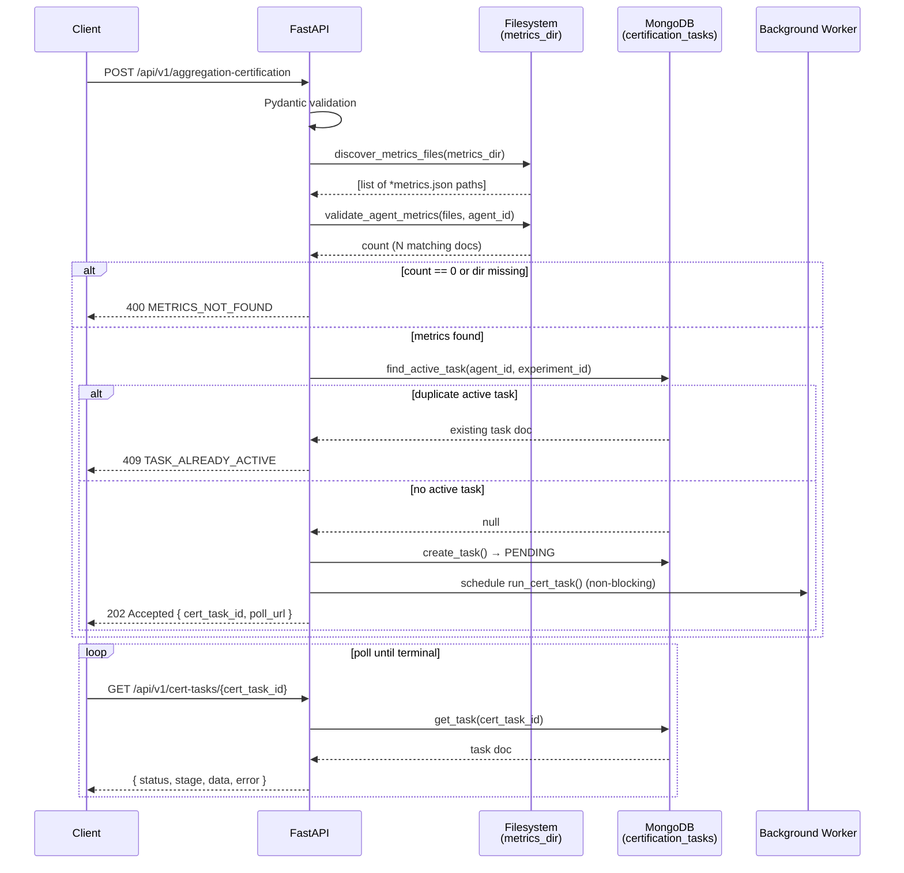
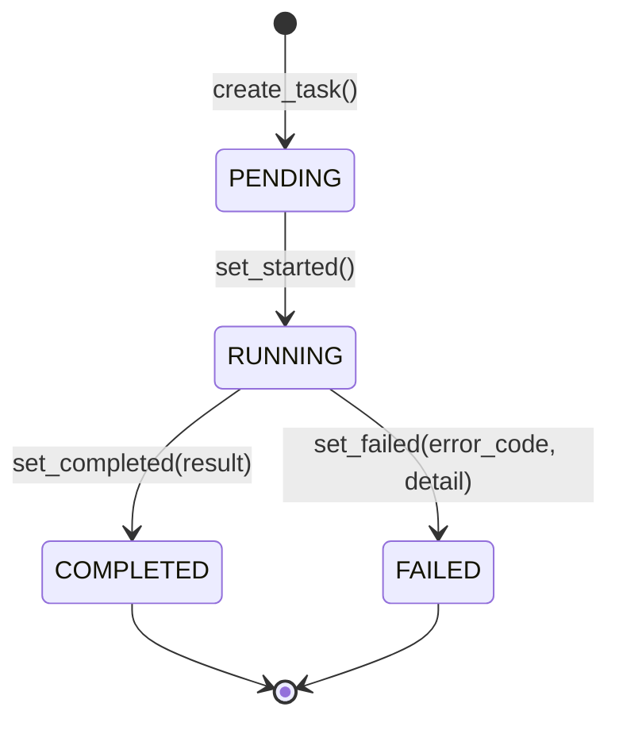
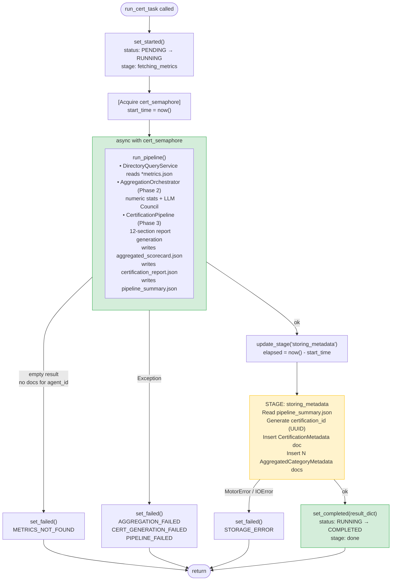
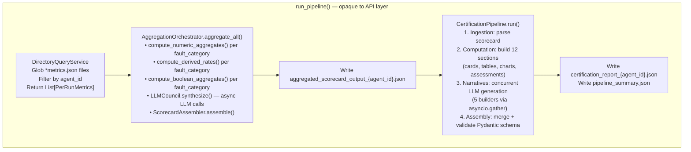
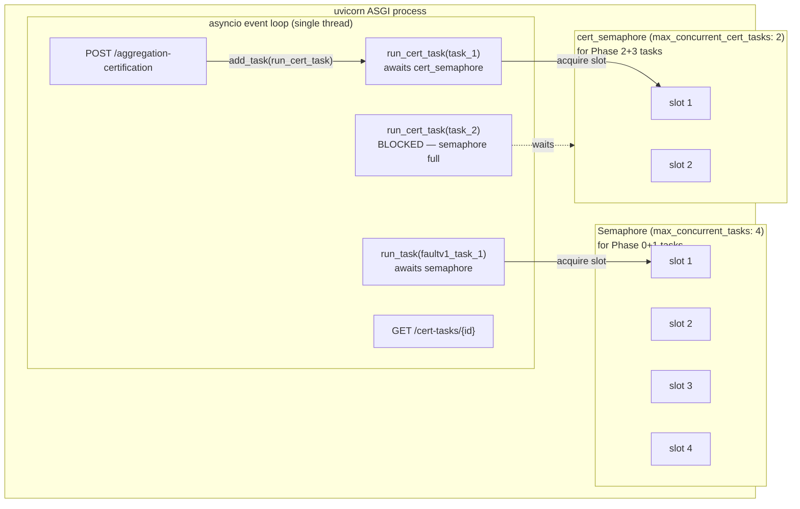
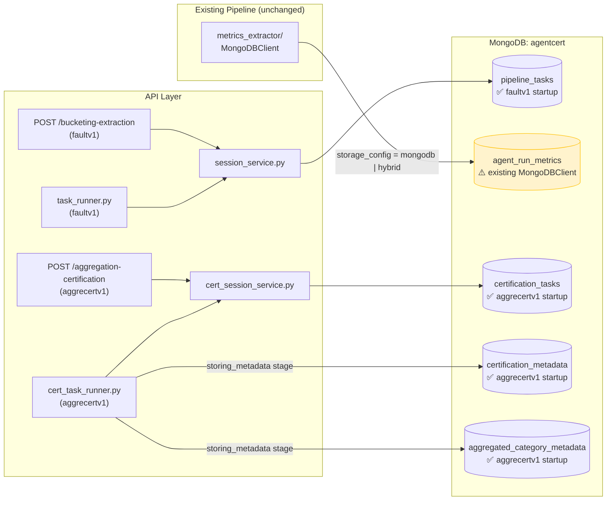
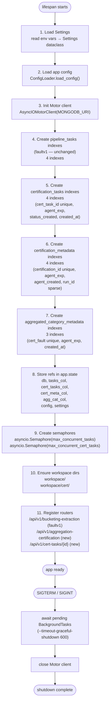

# 08 — Flow Diagrams

---

## 1. API Request Lifecycle (Client View)

---

## 2. Task State Machine

**Rules:**
- `COMPLETED` and `FAILED` are terminal — no further updates.
- `set_completed` / `set_failed` filter on `status = RUNNING` before writing; raise `ValueError`
  if no match (prevents double-write race).
- `set_failed` is safe to call even if `status = PENDING` (handles early failures before
  `set_started` fires).

---

## 3. Task Runner Stage Flow

> The entire `run_pipeline()` call is in one semaphore-guarded block. Stage visible to pollers
> during pipeline execution is `fetching_metrics` (not split between aggregation and certification
> in iteration 1). `storing_metadata` and `done` transitions are milliseconds to a few seconds.

---

## 4. Phase 2+3 Pipeline Internals (inside `run_pipeline()`)

---

## 5. Concurrency Architecture

**Key rule**: `cert_semaphore` and `semaphore` are independent. A Phase 2+3 task waiting for
`cert_semaphore` does not block Phase 0+1 tasks from acquiring `semaphore`, and vice versa.

---

## 6. MongoDB Collection Ownership

---

## 7. Extended App Startup Sequence

