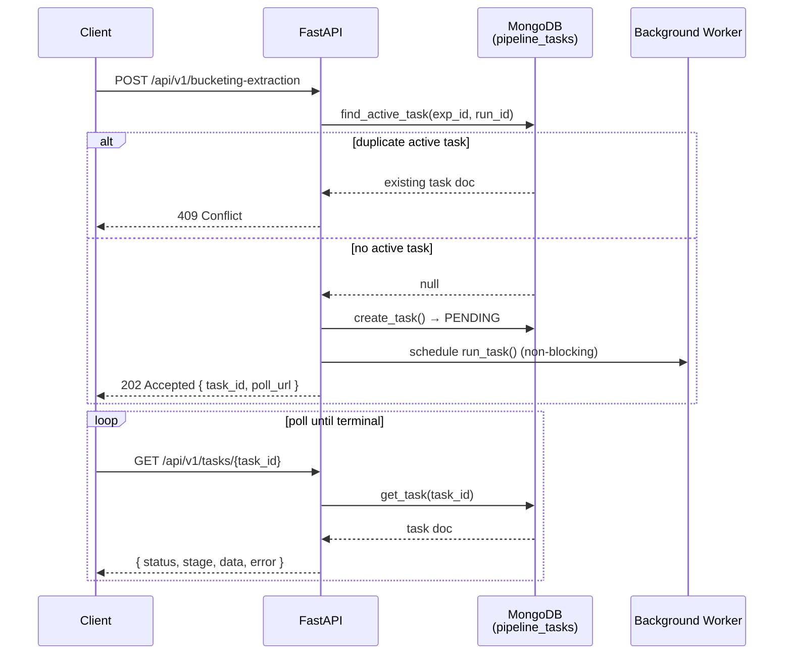
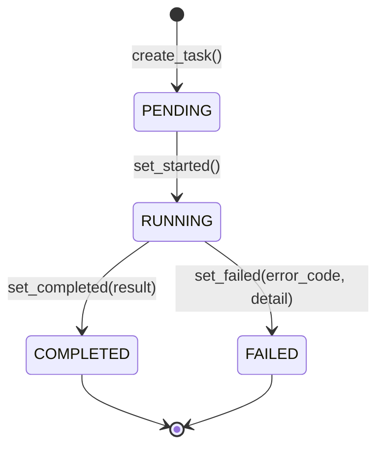
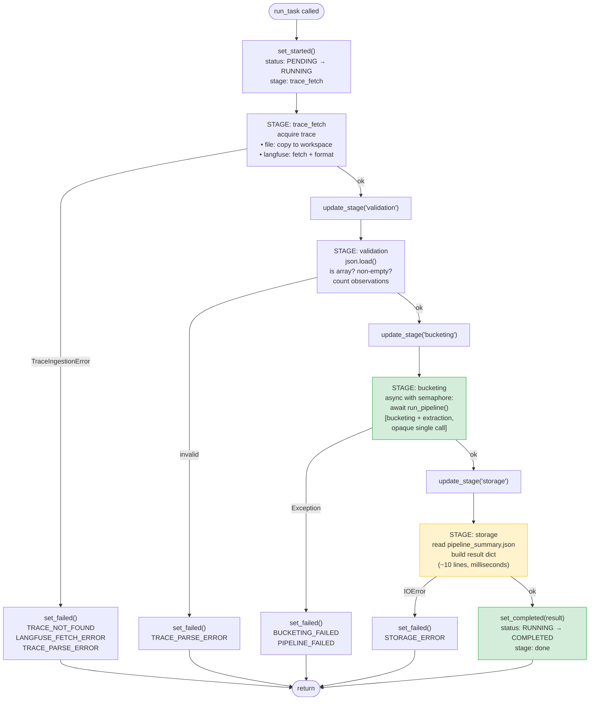
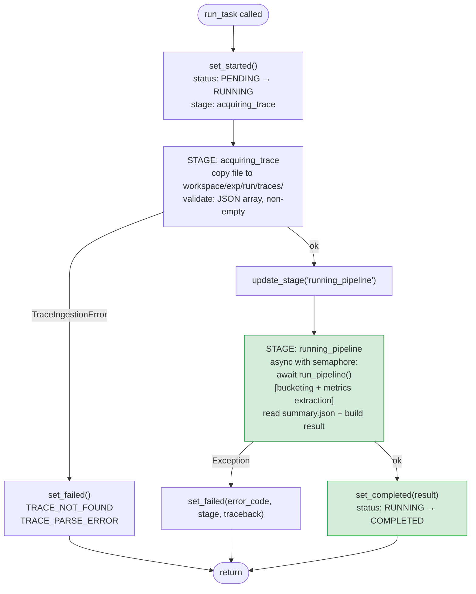
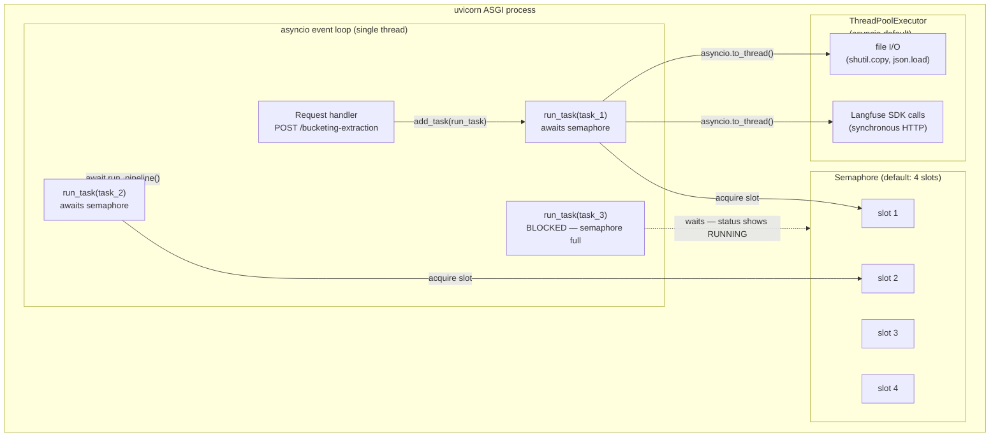
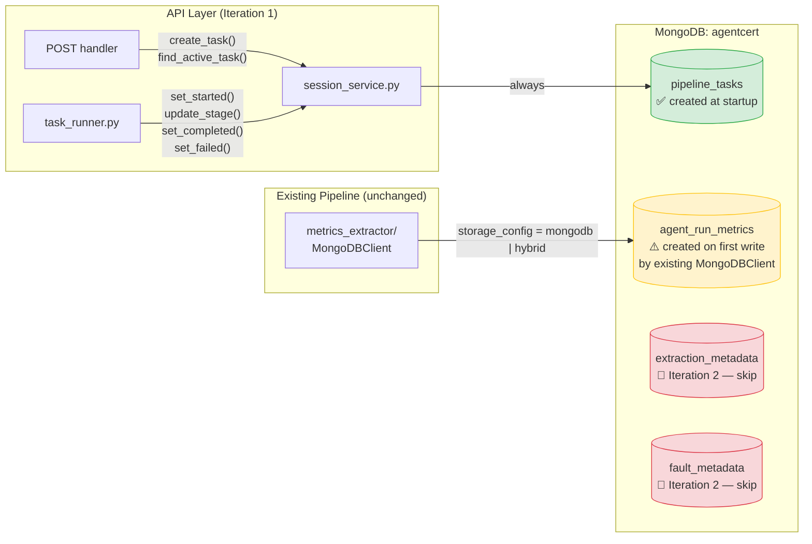
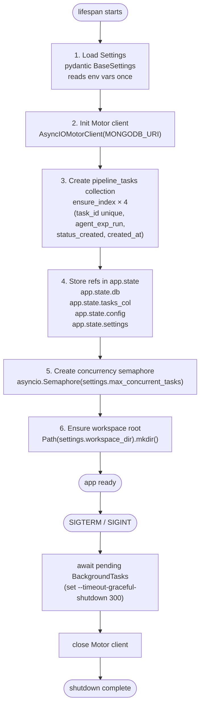

# 08 — Flow Diagrams

---

## 1. API Request Lifecycle (Client View)

---

## 2. Task State Machine

**Rules:**
- `COMPLETED` and `FAILED` are terminal — no further updates.
- `set_completed` / `set_failed` filter on `status = RUNNING` before writing; raise if no match (prevents double-write race).
- `set_failed` is safe to call even if status is still `PENDING` (handles early failures before `set_started` fires).

---

## 3. Task Runner Stage Flow (current — 6 stages)

> `storage` and `done` stages (yellow) are milliseconds long — effectively unobservable by a polling client.
> `metrics_extraction` stage exists in the schema but is **never set** in Iteration 1 (pipeline is opaque).

---

## 4. Task Runner Stage Flow (simplified — 3 stages)

> Validation is folded into `acquiring_trace` (same duration, same failure class).
> Result dict is built inside `running_pipeline` (no observable `storage` stage needed).
> Terminal state is communicated by `status = COMPLETED/FAILED`, not a `done` stage.

---

## 5. Concurrency Architecture

**Key rules:**
- `run_task` is `async` — runs on the event loop, not in a thread.
- All blocking calls inside `run_task` must use `asyncio.to_thread()` (file I/O, Langfuse SDK).
- `run_pipeline()` is already `async def` — awaited directly, no thread needed.
- Semaphore is acquired *after* `set_started()` — tasks show `RUNNING` while waiting for a slot.

---

## 6. MongoDB Collection Ownership

---

## 7. App Startup Sequence

> Step 3 creates **only `pipeline_tasks`**. `agent_run_metrics` is owned by the existing `MongoDBClient`
> in `utils/mongodb_util.py`. `extraction_metadata` and `fault_metadata` are not created until Iteration 2.
